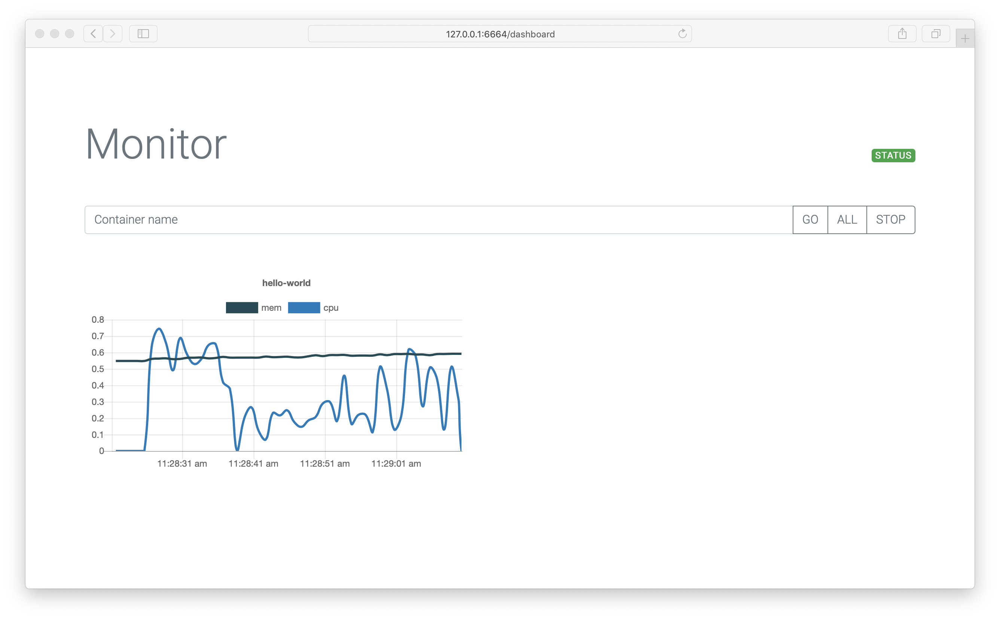

# monitor
Docker load monitoring with real time charts


# Usage
```
Usage monitor:
  -ci  duration
    	set container interval (default 5s)
  -cmi duration
    	set metrics interval (default 1s)
  -port int
    	set api port (default 6664)
  -v	set verbose output
```

# Dashboard

